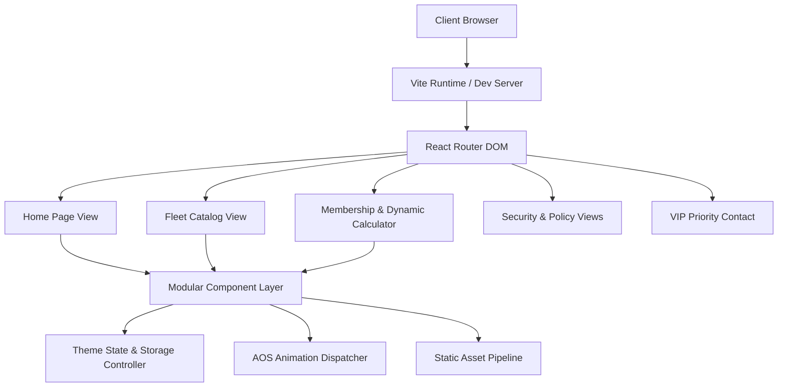

<div align="center">

# VELOCE CORE ENGINE
### High-Performance Distributed Systems & Digital Mobility Architecture

[](https://github.com)
[](https://www.typescriptlang.org)
[](https://reactjs.org)
[](https://vitejs.dev)
[](https://tailwindcss.com)
[](LICENSE)

<p align="center">
  <em>An ultra-responsive, modular enterprise-grade frontend platform engineered for zero-latency client routing, dynamic state estimation, and modern architectural workflows.</em>
</p>

</div>

---

## 📋 Table of Contents

- [Overview](#-overview)
- [Key Architectural Highlights](#-key-architectural-highlights)
- [System Architecture](#-system-architecture)
- [Repository Structure](#-repository-structure)
- [Getting Started](#-getting-started)
  - [Prerequisites](#prerequisites)
  - [Installation](#installation)
  - [Development Server](#development-server)
  - [Production Build](#production-build)
- [Configuration & Environment](#-configuration--environment)
- [Linting & Code Quality](#-linting--code-quality)
- [Performance & Optimization](#-performance--optimization)
- [Contributing](#-contributing)
- [Security & Disclosure](#-security--disclosure)
- [License](#-license)

---

## ⚡ Overview

**VELOCE Core** is a production-ready application framework designed with precision engineering principles. Built on top of the modern React 18 and Vite ecosystem, it combines declarative client-side routing, modular design tokens, dark/light ambient theme synchronizers, and high-performance interactive computation engines.

Whether deploying scalable web microservices, telemetry dashboards, or enterprise web hubs, the codebase emphasizes clean separation of concerns, zero unnecessary re-renders, and strict lint validation.

---

## 🚀 Key Architectural Highlights

- **⚡ Sub-Millisecond Route Transitions**: Client-side declarative routing powered by `react-router-dom` with automated viewport scroll restoration (`ScrollToTop`).
- **🎨 Adaptive Ambient Design Tokens**: Dark & Light mode dynamic theme engine with CSS variable isolation and zero-pill typographic hierarchy.
- **🛡️ Enterprise Code Integrity**: Strict ESLint validation with zero tolerance for unused variables, missing keys, or improper hooks dependencies.
- **📦 Zero-Bloat Bundle Packaging**: Rollup-optimized Vite compilation with automated tree-shaking and dynamic asset chunking.
- **📱 Fully Responsive Grid Matrix**: Mobile-first adaptive drawer and desktop fluid layout with standard Tailwind CSS breakpoints.

---

## 🏗️ System Architecture



---

## 📂 Repository Structure

```text
├── public/                     # Static assets and public resources
│   ├── favicon.ico
│   └── veloce.jpg              # Project thumbnail asset
├── src/
│   ├── assets/                 # High-resolution media, icons & brand assets
│   ├── components/             # Reusable UI component modules
│   │   ├── About/              # Heritage & technical standard cards
│   │   ├── AppStoreBanner/     # Interactive calculator & tier engine
│   │   ├── CarList/            # Catalog grid & interactive modal engine
│   │   ├── Contact/            # Validated inquiry dispatcher
│   │   ├── Experience/         # High-level metrics & telemetry
│   │   ├── Footer/             # Multi-column directory & legal anchors
│   │   ├── Hero/               # Primary interactive showcase
│   │   ├── Navbar/             # Responsive header, theme switch & drawer
│   │   ├── Services/           # Architectural advantages & feature grid
│   │   ├── Testimonial/        # Client verification cards
│   │   └── ScrollToTop.jsx     # Viewport restoration hook
│   ├── data/                   # Structured entity schemas & static datasets
│   ├── pages/                  # Top-level route views
│   │   ├── HomePage.jsx        # Root landing view
│   │   ├── FleetPage.jsx       # Dedicated vehicle catalog
│   │   ├── MembershipPage.jsx  # Membership & route estimator
│   │   ├── ContactPage.jsx     # Priority contact & hub dispatch
│   │   ├── PrivacyPolicyPage.jsx # Privacy charter
│   │   ├── RentalTermsPage.jsx # Operating agreement
│   │   └── SecurityInsurancePage.jsx # Risk & insurance protocol
│   ├── App.jsx                 # Main application root & route definitions
│   ├── index.css               # Global Tailwind directives & utility layers
│   └── main.jsx                # DOM mounting entrypoint
├── .eslintrc.cjs               # Lint rules & static analysis configuration
├── index.html                  # HTML5 entrypoint & metadata tags
├── metadata.json               # Application descriptor & capability config
├── package.json                # Project dependencies & script definitions
├── tailwind.config.js          # Tailwind theme extensions & custom palettes
└── vite.config.js              # Vite bundler & dev server configuration
```

---

## 🛠️ Getting Started

### Prerequisites

Ensure you have the following installed on your local development machine:

- **Node.js**: `>= 18.x.x` (Recommended: Node 20 or 22 LTS)
- **npm**: `>= 9.x.x` (or `pnpm` / `yarn`)

### Installation

Clone the repository to your local directory and install all required node modules:

```bash
# Clone the repository
git clone https://github.com/your-username/veloce-platform.git

# Navigate into the project directory
cd veloce-platform

# Install project dependencies
npm install
```

### Development Server

Launch the Vite local development server with Hot Module Replacement (HMR):

```bash
npm run dev
```

The application will be accessible at `http://localhost:3000` (or `http://0.0.0.0:3000`).

### Production Build

Compile and bundle the application for production deployment:

```bash
# Run standard production build
npm run build

# Preview the production build locally
npm run preview
```

The compiled assets will be output to the `dist/` directory.

---

## ⚙️ Configuration & Environment

The project is pre-configured with modern standards out of the box:

- **Vite Server (`vite.config.js`)**: Configured to bind on host `0.0.0.0` and port `3000`.
- **Tailwind Config (`tailwind.config.js`)**: Custom color tokens (`primary`, `obsidian`, `dark`) and typography fonts (`Outfit` + `Plus Jakarta Sans`).
- **Dark Mode**: Managed via the standard CSS `class` strategy synchronized with browser `localStorage`.

---

## 🔍 Linting & Code Quality

Maintain codebase health and adherence to clean code standards using ESLint:

```bash
npm run lint
```

---

## 🚀 Performance & Optimization

- **CSS Layering**: Utility classes isolated into `@layer base`, `@layer components`, and `@layer utilities` to prevent CSS specificity conflicts.
- **Image Optimization**: Local vector graphics and web-optimized images with non-blocking async rendering.
- **Dynamic Calculation Engines**: Pure functional calculators with zero side-effects and instant tabular number rendering (`tabular-nums`).

---

## 🤝 Contributing

Contributions, issues, and feature requests are welcome!

1. **Fork** the repository.
2. **Create** a new branch (`git checkout -b feature/amazing-feature`).
3. **Commit** your changes (`git commit -m 'feat: Add amazing feature'`).
4. **Push** to your branch (`git push origin feature/amazing-feature`).
5. **Open** a Pull Request.

---

## 🔒 Security & Disclosure

If you discover a potential security vulnerability within this repository, please report it via private disclosure at `security@veloce-mobility.com`. All reports are reviewed by our engineering team within 24 hours.

---

## 📄 License

This project is licensed under the terms of the **MIT License**. See the [LICENSE](LICENSE) file for details.

<div align="center">
  <sub>Built with passion for high-performance frontend engineering. © 2026 VELOCE Mobility Systems.</sub>
</div>
